<p align="center">
  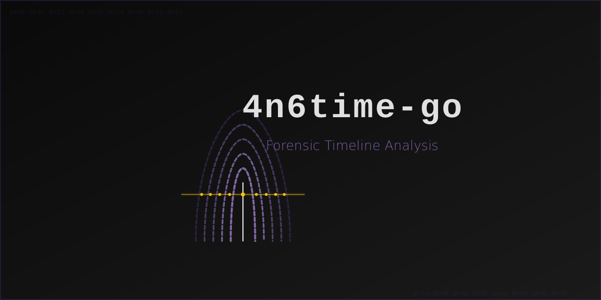
</p>

# 4n6time-go

Forensic timeline analysis tool, rewritten from Python to Go. Desktop application for analyzing large-scale forensic datasets, particularly timeline data from log2timeline (L2T) format files.

## Features

- Import L2T CSV, Plaso JSONL, TLN, L2TTLN, and dynamic CSV files (tested with 2GB+ files, millions of events)
- **SQLite and PostgreSQL** database backends (SQLite for local work, PostgreSQL for team/server deployments)
- **Examiner notes**: add timestamped investigation notes directly into the timeline grid alongside evidence events
- **Advanced search**: toggle between keyword search and SQL WHERE clause mode with full query syntax
- **Bulk select and edit**: shift-click or ctrl-click to select multiple rows, then apply color, tags, or bookmarks to all at once
- **Multi-import**: import additional timeline files into an already-open database to combine evidence sources
- Server-side pagination with First, Last, Go-to-page, and "Page X of Y" controls
- Full-text search across all key event fields with keyword highlighting
- Filter panel with AND/OR logic, date range, and multi-field filters
- Timeline histogram with click-to-filter and drag-to-select range
- Resizable event detail panel with editable tags, colors, and notes
- Bookmark events with star toggle (filter to show bookmarked only)
- Color-coded rows for marking events of interest
- Push SQLite data to a PostgreSQL server for sharing with a team
- Saved queries (stored in the database file)
- Column visibility toggle (show/hide any of the 24+ columns)
- Export filtered results to CSV
- 11 UI themes (Forensic Dark, Classic Dark, High Contrast, Light, Solarized, Monokai, Dracula, Nord, Gruvbox, Matrix, Forensic Blue)
- Built-in logging system for troubleshooting (Help > Logging)
- Built-in user guide (no internet required)
- Native desktop menus with keyboard shortcuts
- Multi-platform builds via GitHub Actions (Linux, Windows, macOS)

## Screenshots

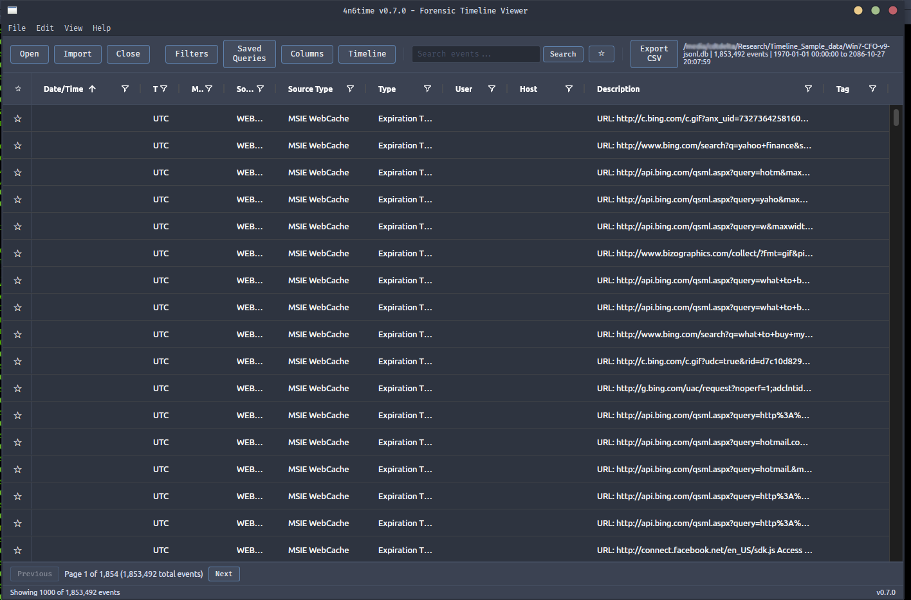

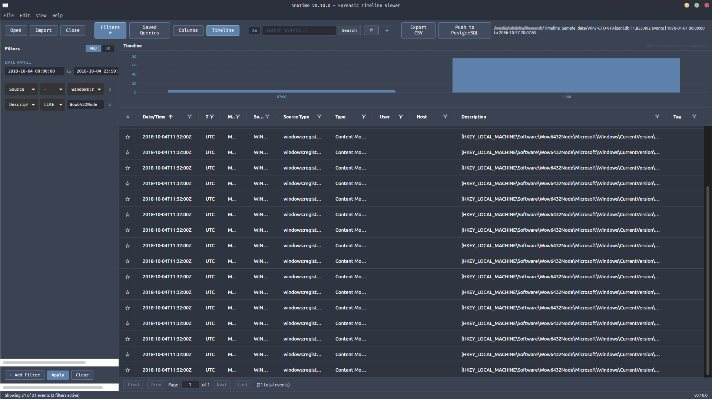

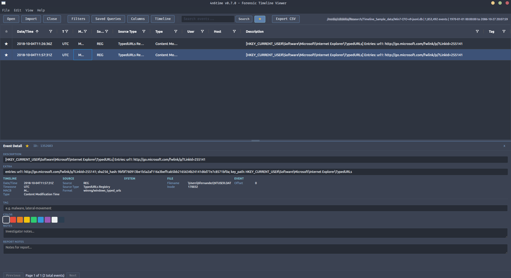

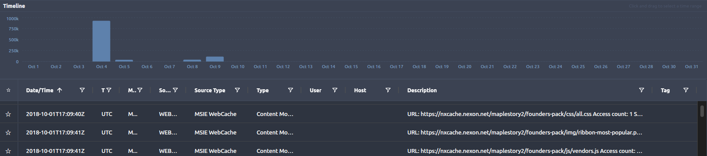

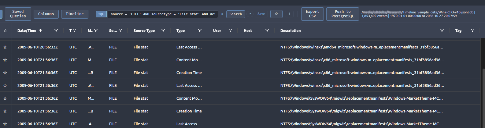

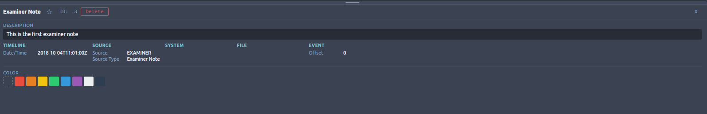

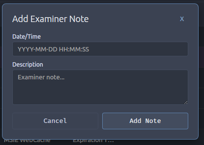

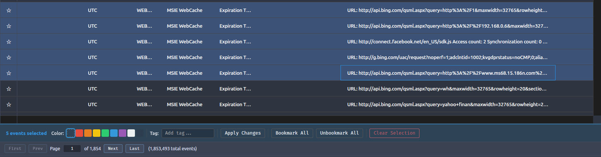

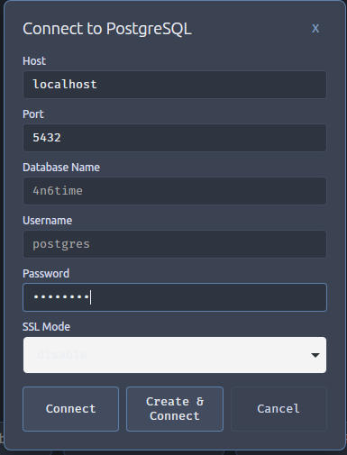

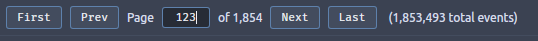

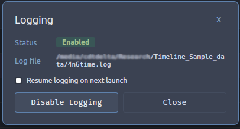


## Tech Stack

- **Backend:** Go, SQLite (modernc.org/sqlite, pure Go), PostgreSQL (pgx)
- **Frontend:** React, AG Grid, Recharts
- **Framework:** Wails v2 (native desktop, no Electron)

## Building

### Prerequisites

- Go 1.23+
- Node.js 22 LTS
- Wails CLI: `go install github.com/wailsapp/wails/v2/cmd/wails@latest`
- Linux: `libgtk-3-dev libwebkit2gtk-4.1-dev pkg-config`
- Windows: WebView2 runtime (included in Windows 10/11)
- macOS: No additional dependencies

### Build

```bash
cd frontend && npm install && npm run build && cd ..
wails build -tags webkit2_41   # Linux
wails build                     # Windows / macOS
```

The binary is output to `build/bin/`.

### Development (Docker)

```bash
docker compose up -d
docker compose exec dev bash
cd /workspace/frontend && npm run build
cd /workspace && wails build -tags webkit2_41
```

Run the binary on the host: `~/source/4n6time-go/build/bin/4n6time`

## Usage

1. Launch the application
2. Click **Import** to import a timeline file (L2T CSV, JSONL, TLN, L2TTLN, or dynamic CSV), or **Open** to load an existing database
3. Use the **Filters** panel to narrow results by source, host, type, user, or date range
4. Click **Timeline** to visualize event distribution over time
5. Click any row to view full event details and add tags/notes/colors
6. Use **Saved Queries** to store and recall frequently used filter sets
7. Use **Columns** to show or hide fields in the grid
8. Use **Export CSV** to save filtered results
9. Change the UI theme via **View > Theme** (Ctrl+T)

### Examiner Notes

Add timestamped investigation notes directly into the timeline alongside evidence events. Click the **+** button in the toolbar to open the Add Note dialog. Enter a date/time (or click "Now"), a description, and an optional tag. Notes appear in the grid with source "EXAMINER" and can be color-coded and bookmarked. Notes are immutable after creation; to change one, delete it from the detail panel and re-enter it.

### Advanced Search

Toggle between simple keyword search and SQL WHERE clause mode using the **Aa/SQL** button next to the search bar. In SQL mode, enter any valid WHERE clause using field names and SQL operators:

```
source = 'FILE'
desc LIKE '%malware%' AND host = 'WORKSTATION1'
datetime BETWEEN '2025-01-01' AND '2025-06-01'
```

Click the **?** button to see all available field names and operators. Advanced queries can be saved and loaded from the Saved Queries panel. On PostgreSQL, the reserved words `desc`, `user`, and `offset` are auto-quoted.

### Bulk Editing

Select multiple rows using shift-click (range) or ctrl/cmd-click (individual toggle). When multiple rows are selected, a bulk action bar appears with color swatches, a tag input, bookmark buttons, and an "Apply Changes" button. Select a color and/or enter a tag, then click Apply Changes to update all selected events at once. Examiner note tags are protected from bulk tag changes.

### Multi-Import

When a SQLite or PostgreSQL database is already open, importing a timeline file appends the data to the existing database instead of creating a new one. This lets you combine multiple evidence sources (e.g., multiple hard drive images) into a single investigation database.

### PostgreSQL Support

4n6time can connect to a PostgreSQL server as an alternative to local SQLite databases:

1. Click **PostgreSQL** on the welcome screen to open the connection dialog
2. Enter connection details: host, port, database name, username, password, and SSL mode
3. Click **Connect** to connect to an existing database, or **Create & Connect** to create the schema on an empty database
4. When connected to PostgreSQL, importing a timeline file writes directly to the server (no local file needed)
5. To push an existing SQLite database to PostgreSQL, open the SQLite database first, then click the **Push to PostgreSQL** button in the toolbar

## Acknowledgments

Special thanks to David Nides for creating the original 4n6time application, which served as the inspiration for this project.

## License

MIT License. See [LICENSE](LICENSE) for details.
